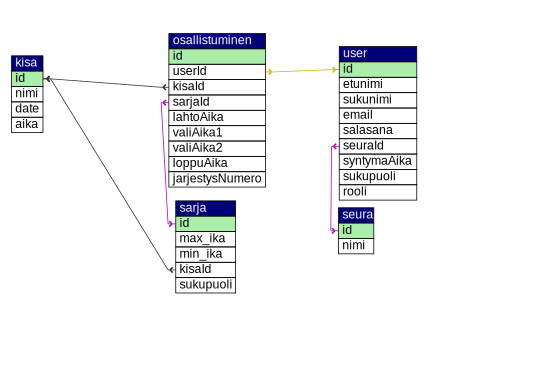

# hiihtokisat3000
Ohjelmoinnin erikoiskurssi - Harjoitustyö

- Alimu Ayiding (Verkkosovellus, tietokannan suunnittelu ja toteutus)
- Kim Lehtinen (Verkkosovellus, tietokannan suunnittelu ja toteutus, tietoturva, UI)
- Joonas Kyttänen (Verkkosovellus/Desktop app)
- Santeri Kuurila (Desktop app)

## Tietokanta

Ryhmä 4 virallinen tietokanta voidaan vaan käyttää technobotnialla.

Testausta varten löytyy tilapäinen tietokanta Kimin palvelimella [http://lehtin.com](http://lehtin.com).

## Näin Github toimii

### Lisää tekemäsi muutokset
Lisää tiedostot: `git add .`

Kerro mitä ole tehnyt: `git commit -m "Kirjoita tänne jotain"`

Päivitä remote: `git push origin master`

### Hae viimeiset muutokset
`git pull origin master`

## If you don't have XAMPP on your machine
- `php -S localhost:4000`
